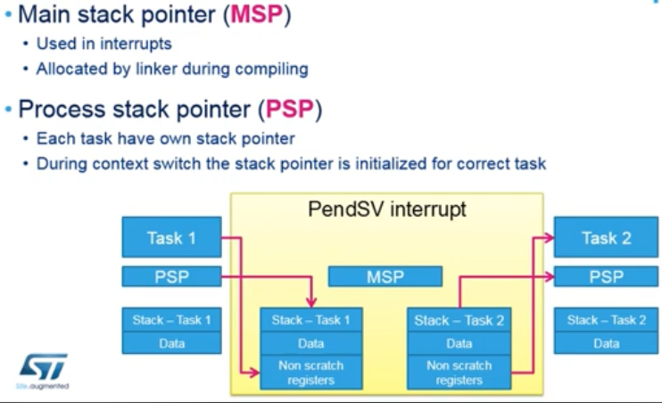

# Tasks 

## What is a task? 

It's a C function 
 - init code 
 - never ending loop 

```
FirstTask(void const *argument)
{
    for(;;)
    {
        /* Task code */
    } 
    // we should never get here 
} 
``` 

 - it can be used to generate any number of tasks 
 - has its own part of stack (each instance), and priority 
 - RUNNING, BLOCKED, READY, or SUSPENDED 
 - created and deleted using osThreadCreate() / osThreadDelete() 

### Task Consists of 
 - program code (ROM) 
 - stack, residing in RAM that can be accessed by the stack pointer (has the same function as in single-task system: storage of return addresses of function calls, parameters, local variables, and temporary storage of intermediate calculations and register results)
 - TCB - task control block 
    - data structure assigned to a task when it's created 
    - contains status information of task, including SP, task priority, current task status 


 - Two calls to pvPortMalloc are made during task creation 
    1. TCB 
    2. Task Stack (taken from FreeRTOS heap area) 
 - process of saving context that is being suspended and restoring context is called context switching 

### Task States 

1. Ready 
 - task is ready to be executed but not currently executing because a task with equal or higher priority is running 
2. Running 
 - task is actually running (only one task in this state at a time) 
3. Blocked 
 - task is waiting for either a temporal or an external event 
4. Suspended 
 - task not available for scheduling, but being kept in memory 

Start with osThreadCreate -> puts task in Running 

Ready to ____ : 
 - Running: Scheduler (higher priority) 
 - Blocked: impossible, cannot happen  
 - Suspended: osThreadSuspend()

Running to ____ : 
 - Ready: osThreadYield() 
 - Blocked: osDelay, osDelayUntil, waiting for resource 
 - Suspended: osThreadSuspend() 

Blocked to ____ : 
 - Running: impossible, cannot happen 
 - Ready: Event occures (user defined) 
 - Suspended: osThreadSuspend() 

## Context Switching 

 - Tick Timer (SysTick for Cortex-M) interrupt causes execution of xPortSysTickHandler() port.c 

 - xPortSysTickHandler() is usually written in assembly 
    - blocks all interrupts (necessary, because it has lowest possible priority) using portDISABLE_INTERRUPTS() macro defined in (portmacro.h) 

    - Activates PendSV bit to run an interrupt that executes xPortSendSVHandler() function (port.c file) 
    - Calls vTaskSwitchContext() function (task.c) 
        - calls a macro taskSELECT_HIGHEST_PRIORITY_TASK() (task.c) to select the READY task on the highest possible priority list 
    - Unblocks interrupts using portENABLE_INTERRUPT() macro (portmacro.h) 

### A note on context switch time 

 - depends on port, compiler, and configuration 
 - is stack overflow checking on? 
 - are trace features on? 
 - is compiler set to optimize? 
 - configUSE_PORT_OPTIMISED_TASK_SELECTION set to 1 in FreeRTOSConfig.h? 

 - Cortex-M CPU registers that are not automatically saved on interrupt entry can be saved with a single assembly instruction, then restored again with a further single assembly instruction. These two instruction use 12 CPU cycles each. 

 - Context Switch can be much longer in Cortex-M4/M7 based devices witht he FPU due to stacking of FPU registers (addition 17 32 bit registers) (S0-S15, FPSCR)
 - other 16 should be handled in software (S16-S31) 
 - Within PendSV handler there is a check done whether floating point unit has been used and based on this info, the registers are stacked/unstacked with the current task. 

 ```
 /*
    is task using FPU?
    if so push high vfp registers
 */
 tst r14, #0x10
 it  eq
 vstmdbeq r0!, {s16-s31}
``` 
 - Then on PendSV exit after task switch 
```
 /* 
    is task using FPU? 
    if so, pop high vfp registers
 */
 tst r14, #0x10 
 it  eq 
 vldmiaeq r0!, {s16-s31}
``` 

 
