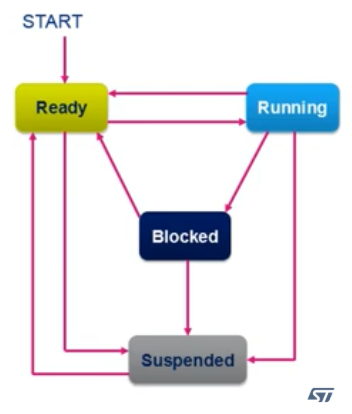
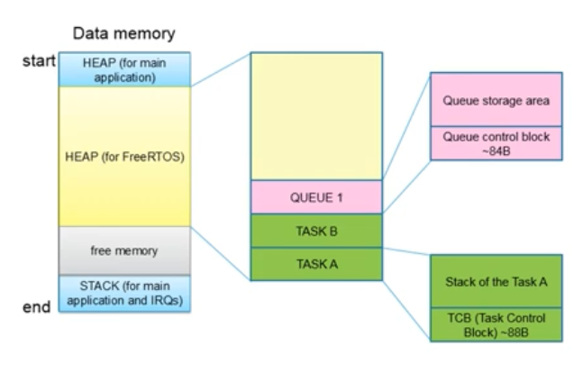
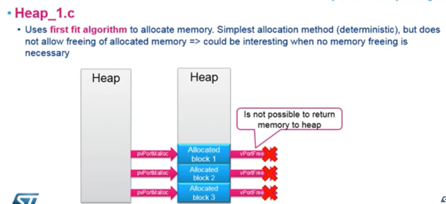
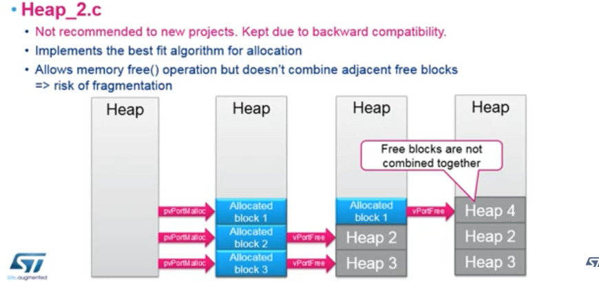
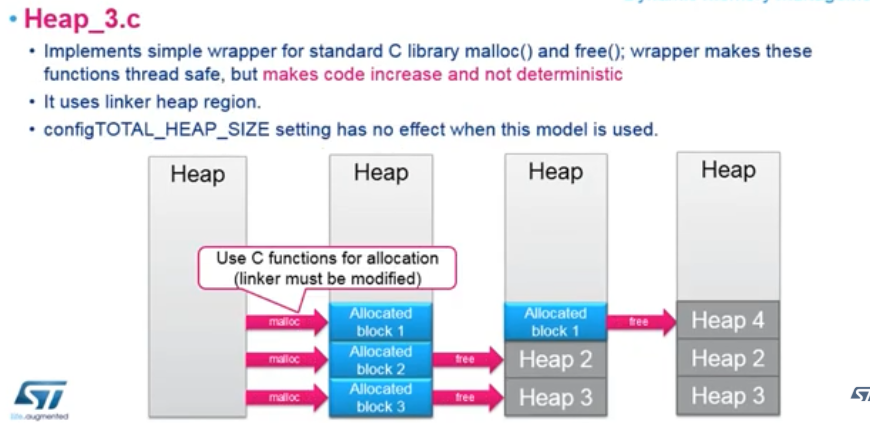
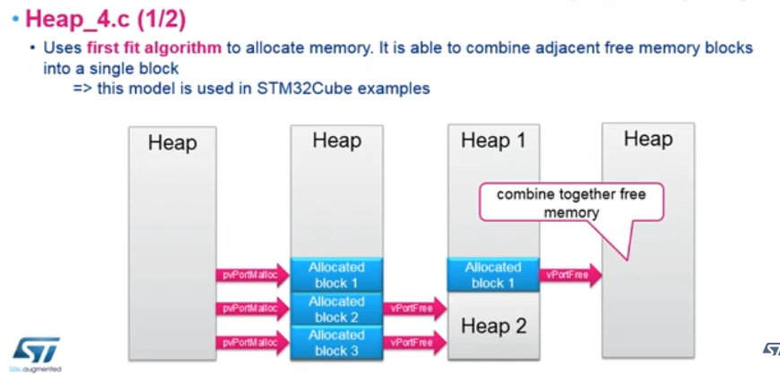
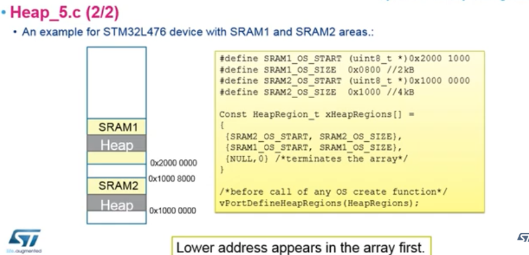

# FreeRTOS on STM32

FreeRTOS is: 
 - An Operating System 
    - used for: 
     - scheduling 
     - interrupts 
     - resource management 

Question: Can an 80Mhz, single core, M4 execute parallel tasks? 

Answer: No. There is one pipeline, it chugs one instruction at a time. 

FreeRTOS gives you the ability to implement something big, without giving you the whole software ecosystem. It can fit in 10-20kB easily. 

### Features: 

 - preemptive or cooperative multitasking 
 - tiny memory footprint (10kb in flash) 
 - tickless and low power modes 
 - synchronization and inter-task communication 
    - message queues 
    - binary and counting semaphores 
    - mutexes 
    - group events (flags) 
 - software timers for task scheduling 
    - register a callback and program timer with a timeout to synchronize tasks as well (totally valid use)
Everything is implemented using **tasks** 

## Tasks 

```
// A task is just a C function that runs an infinite loop
for(;;)
{
    /* Task code */
}
```

- Each task has its own stack and priority 
- It can be in one of four states: 
 - RUNNING 
 - READY 
 - BLOCKED 
 - SUSPENDED 

 

- created with API functions 
- the SysTick (System Timer) generates a periodic IRQ which activates the scheduler, who chooses which task will run next, based on priority and which tasks are in the READY and RUNNING state. 
- The SysTick gives tasks a timeslice to work between (note, FreeRTOS supports cooperative multitasking (no preemption, tasks run after one finishes)) 

### OS HEAP 
 

### SysTick (System Timer) 
- STM32L47x uses a 24-bit ARM Cortex-M4 SysTick down counter for timing and scheduling. It's usually configured with HAL_Init() to generate 1ms interrupts. It operates on AHB Clock (HCLK). HCLK is derived from SYSCLK via a prescaler, operating off of oscillators/PLLs, and feeding the CPU, memory, and peripherals. 

 - The SysTick is what generates the FreeRTOS tick, or the time slice (periodic time base). It generates the IRQ. 

### Brief aside on SYSCLK, HCLK, PCLK, and SysTick
SYSCLK is the root clock for the entire system. 
HCLK is the high-speed bus clock for AHB (Advanced High-performance Bus). 

SYSCLK comes from HSI, HSE, or PLL. HCLK is created by dividing SYSCLK. HCLK <= SYSCLK

PCLK is the APB, or peripheral clock, derived from HCLK, but operating at lower frequencies. PCLK = HCLK / 2 (or 4) 

SysTick is the 24-bit down counter, acts as timer. Generates precise time ticks (for RTOS/delays). Uses HCLK as its source. 

### Core Resources: 

 - SysTick (generates RTOS tick) 
 - Two Stack Pointers: 
    1. MSP - main stack pointer
        used by interrupts and the scheduler 
    2. PSP - program stack pointer 
        used by the task 

### Interrupt Vectors: 
 - SVC - system service call 
 - PendSV - pended system call (context switching) 
 - SysTick - System Timer 

### Flash Memory: 
 - 6-10kB

### RAM Memory: 
 - 0.5kB + task stacks (on the OS Heap) 

### System Service Call (SVC) 
 
 - system service call / supervisor call 

 - launched by an instruction where the instruction holds the number of the request (not used by FreeRTOS that much) 

 - it is an instruction and exception. Once **svc** instruction has executed, SVD IRQ is triggered immediately (unless there is higher priority IRQ active) 

 - contains 8 bit immediate value to determine what OS service is requested. 

 - Do not use SVC in NMI or Hard Fault handler 

### Pended System Call (PendSV) 

 - Pendible System Call interrupt takes care of context switch. Triggered by software. 

 - It is launched using: 
 ```
    SCB->ICSR |= (1 << 28);
 ```
 - Pendible, meaning, it can wait. CPU can execute a number of instructions before the exception will start. It is used like a subroutine called by the system timer in OS. 

 - Executes when all higher priority interrupts are finished 

 - SVC executed immediately 

### System Timer 

 - System Timer is triggering PendSV SW interrupt. SysTick is used as timebase. CubeMX doesn't like this, it wants a different timebase. Several different tasks may wait for the same SysTick interrupt, creating a lock. So using SysTick as a timebase is not advised, use a copy (TIM6 or TIM7). Timers used for RTOS can't be used for other purposes. Only as timebase for HAL.  

## File Structure: 
 - Different files for different functionality
 - There exists common source files, but also vendor-specific files. 
    - among these, the port layer exists 
    - FreeRTOSConfig.h 
    - also the heap files (1-5) (choose one) 

## Available APIs 

### Native API (FreeRTOS) 

 c - char 
 s - short 
 l - long 
 x - portBASE_TYPE (defined in portmacro.h for each platform) (STM32 it is long) 
 u - unsigned 
 p - pointer 

 function structure: | prefix | file name | function name | 
 example: v | Task | PrioritySet 
 
 prv - means private 

 macro prefix - defines file location: 
 port 
 task 
 pd 
 config 
 err 

 pdTRUE 
 pdFALSE 
 pdPASS 
 pdFAIL 

### CMSIS_OS API 

Cortex-M standard (ST helped) is something ARM standardized. Helps you to control any microcontroller based on Cortex-M cores. Adapted by lots of vendors (ST's competitors). CMSIS is interchangeable code. Since ARM realized there are a lot of different ports, they standardized the API for RTOS's as well. Their API accepts common RTOS functions, offers their layer (neutral). 

 - Thread Management 
 - Kernel Control 
 - Semaphore management 
 - Message queue and mail queue 
 - Memory management 

```
osKernelStart = vTaskStartScheduler 
osThreadCreate = xTaskCreate 
osSemaphoreCreate = vSemaphoreCreateBinary/Counting 
osMutexWait = xSemaphoreTake 
osMessagePut = xQueueSend / xQueueSendFromISR 
osTimerCreate = xTimerCreate 

**note** most functions return osStatus value. 
osThreadId = TaskHandle_t 
osMessageQId = QueueHandle_t 
osSemaphoreId = SemaphoreHandle_t 
osMutexId = SemaphoreHandle_t 
osTimerId = TimerHandle_t 
``` 

### Parameters set in FreeRTOSConfig.h 

- configUSE_PREEMPTION = enables preemption 
- configCPU_CLOCK_HZ = CPU clock frequency in HZ 
- configTICK_RATE_HZ = tick rate in Hz 
- configMAX_PRIORITIES = maximum task priority 
- configTOTAL_HEAP_SIZE = total heap size for dynamic allocation 
- configLIBRARY_LOWEST_INTERRUPT_PRIORITY = lowest interrupt priority 
- configLIBRARY_MAX_SYSCALL_INTERRUPT_PRIORITY = highest thread safe interrupt priority 

### HEAP Memory Management 

 - FreeRTOS has a specific HEAP memory area. This is where your initialized task and queues have their TCB and stack. If you are running your application without FreeRTOS, call malloc. If not, you need PvPortMalloc(), and PvPortFree(). 

 - each TCB is 24 words min (96 bytes) 
 - if configUSE_TASK_NOTIFICATIONS enabled - adds 8 bytes 
 - if configUSE_TRACE_FACILITY enabled - adds 8 bytes 
 - if configUSE_MUTEXES - adds 8 bytes 

 Task stack size is passed as argument when creating task. 
 The task stack size is defined in words of 32 bits not in bytes. 

 osThreadDef(Task_A, Task_A_Fucntion, osPriorityNormal, 0, stacksize); 

 FreeRTOS requires to allocate in the heap for each task: 
  number of bytes = TCB_size + (4 * task stack size); 

 uxTaskGetStackHighWaterMark(); 
 - use an initial large stack size allowing the task to run without issue (4kB for example) 
 - uxTaskGetStackHighWaterMark() returns the minimum number of free bytes (ever encountered) in the task stack. 
 - calculate the new stack size as the initial stack size minus the minimum stack free bytes 
 - method requires that the task has been running enough to be in worst case 

 When timers are added configUSE_TIMERS, the timer daemon is created, and it processes all the software timers. The timer task will take care of the proper scheduling. 

### Heaps 1-5 (quickly) 

1. Heap_1.c 

  

 - uses first fit algorithm to allocate memory. Does not allow freeing of allocated memory. Stays in heap forever Very fast memory allocation (nice when no memory freeing is necessary, doesn't search for empty blocks) 

2. Heap_2.c 

  

 - best fit algorithm for allocation. Allows free but doesn't combine adjacent blocks (risk of fragmentation) 

 - free blocks are not combined together 
 - not recommended, especially for when you want to add lots of small objects to the heap 

3. Heap_3.c 

  

 - Implements wrapper around malloc() and free(). 
 - uses linker heap region 
 - configTOTAL_HEAP_SIZE has no effect if using this heap. 

4. Heap_4.c 

  

 - first fit algorithm 
 - whenever you free a block, checks surrounding blocks 
 - connects adjacent free blocks 
 - preferred, but only fits in one memory 
 
5. Heap_5.c 

  

 - same thing as 4, but supports different (non-contiguous) memory blocks. It must be explicitly initialized before any OS object is created (before an pvPortMalloc() call) 

 - nice, because you can use any address in micro controller 
 - blocks cannot cross boundaries though... 
 - much more RAM for application 

### Alternate Functions 

// create memory from pool 
// blocks of fixed size can come from pool
PoolHandle = osPoolCreate(osPool(Memory)) 
// allocate pool from memory
uint8_t* buffer = osPoolAlloc(PoolHandle);
// not recommended outside of TCP/IP packets where you need to return memory quickly 

## Scheduling 

### Cooperative Multitasking 

 - requires cooperation of ALL tasks 
 - each task allows other tasks to run 
 - tasks gets blocked by calling function 
 - RUNNING goes to READY, BLOCKED, or SUSPEND 
 - tasks are not preempted by higher priority tasks 
 - get all the time you need to finish job 
 - no time base needed 
 - requires configUSE_PREEMPTION 0 

### Preemptive Multitasking (default) 
 - tasks with same priority share CPU time 
 - context switch when: 
    - time slice has passed 
    - task with higher priority has come 
    - task goes to blocked state (delay)
    - task goes to ready state (yield) 
    - requires configUSE_PREEMPTION 1
 - timeslice happens in interrupt 
 - non-reentrant functions won't work (printf) 
    - if you're interrupted, it overwrites the internal variables and becomes non-consistent. Crashes application. 

### Cooperative with preemption by IRQ 
 - IRQs are used to trigger context switch 
 - Preemptive without time slice 
 - requires configUSE_PREEMPTION 0

### Scheduler Basics: 
 - algorithm to determine which task to execute. 
 - triggered by PendSV, scans all the tasks in READY state, and chooses one with highest priority. If priorities are equal amongst task, it uses Round Robin. 

## FreeRTOS OS interrupts 

### PendSV 
 - used for task switching before tick rate 
 - lowest NVIC priority interrupt 
 - not triggered by any peripheral 

### SVC interrupt 
 - interrupt risen by SVC instruction 
 - SVC 0 call used only one, to start the scheduler, 
 within vPortStartFirstTask() which is used to start the kernel. 

### SysTick Timer 
 - lowest NVIC priorty 
 - used for task switching on configTICK_RATE_HZ timebase 
 - set PendSV is context switch is necessary 

## NVIC Configuration 