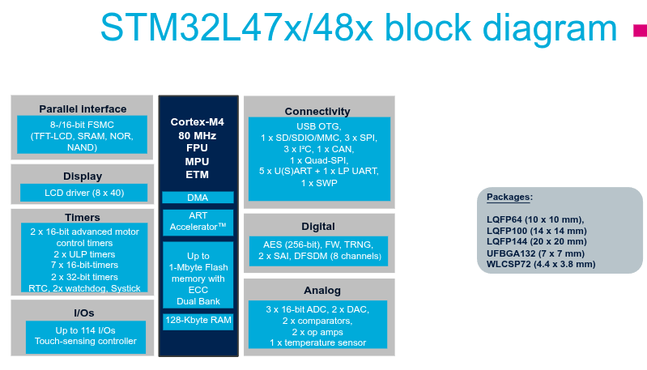

---
title: STM32L4 Intro 
parent: STM32L4 Basics
nav_order: 1 
--- 

# STM32L4 Intro 

Four characterizations:

Ultra-low power (ULP) (100 DMIPS based on ARM Cortex-M4 with FPU and ST adaptive real-time memory accelerator at 80Mhz) 

Smart Peripherals 

1MB Flash, 128kB SRAM, 3.8x4.4mm packages 

pin-pin compatibility of STM32 family 

### L4 Product Lines Define by: 

- Access, USB, USB+LCD, USB OTG, or USB OTG+LCD 

 
