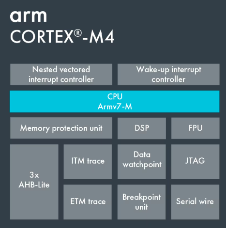

---
title: STM32L4 System 
parent: STM32L4 Basics
nav_order: 2
--- 

# STM32L4 Core 

 

Integrates a Cortex-M4 core from ARM to benefit from the 32 bit architecture and low power consumption. 

### Architecture: Armv7E-M 

[Reference Manual](https://developer.arm.com/documentation/100166/0001/) 

[Datasheet](Arm-Cortex-M4-Processor-Datasheet.pdf) 