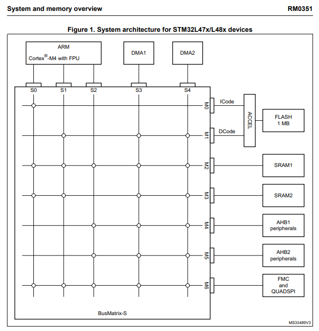
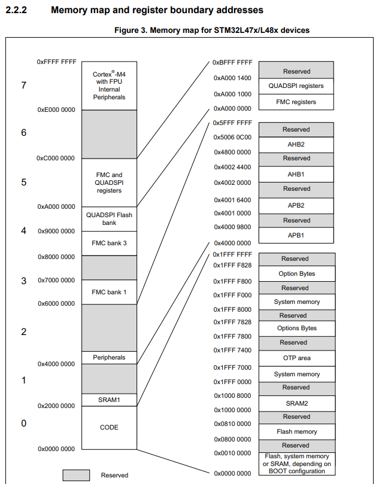
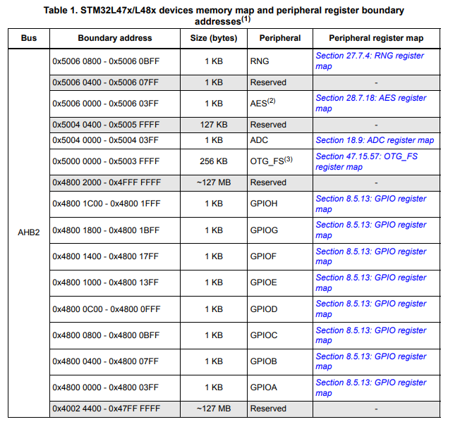
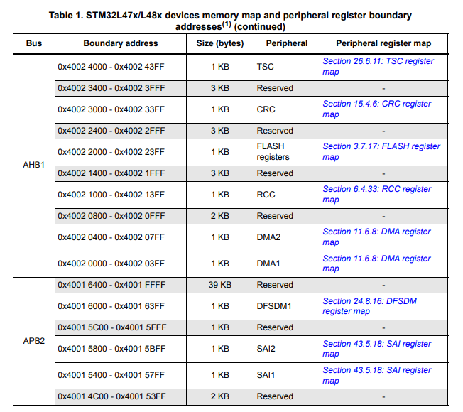
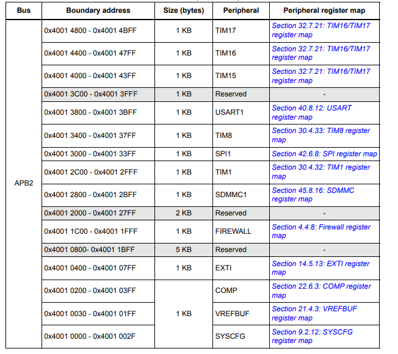
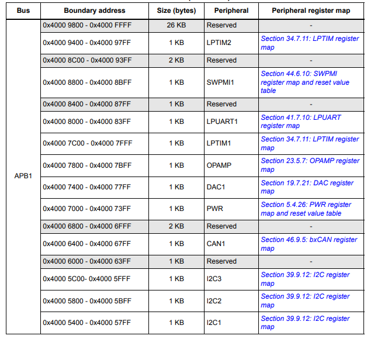
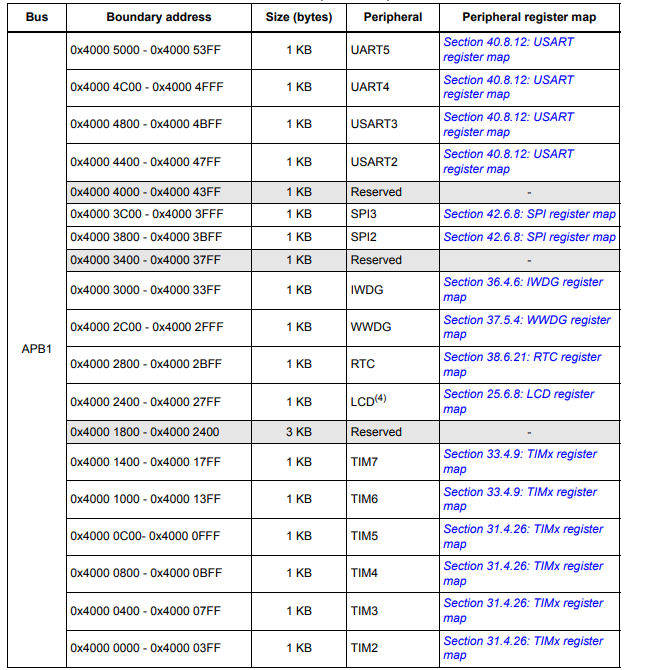
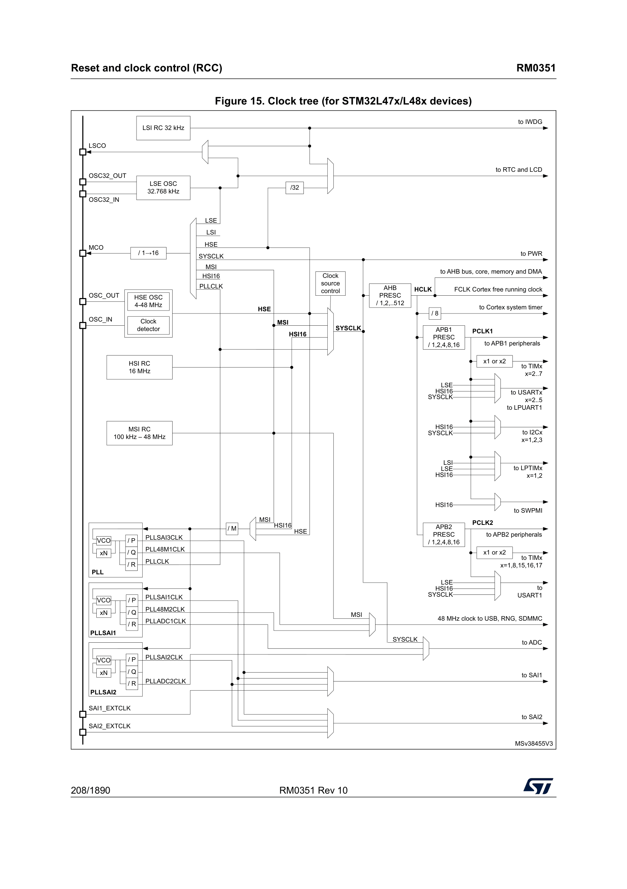

---
title: STM32L47x Architecture 
parent: Cramer's FreeRTOS Homepage 
nav_order: 3
--- 

# STM32L47x Architecture 

## [STM32L47x Reference Manual](rm0351-stm32l47xxx-stm32l48xxx-stm32l49xxx-and-stm32l4axxx-advanced-armbased-32bit-mcus-stmicroelectronics.pdf)

Main system is 32-bit (multilayer) AHB bus matrix: 
 - Five Masters 
    1. Cortex-M4 with FPU core I-bus 
    2. Cortex-M4 with FPU core D-bus 
    3. Cortex-M4 with FPU core S-bus 
    4. DMA1 
    5. DMA2 

 - Eight Slaves 
    1. Internal Flash memory on ICode Bus 
    2. Internal Flash memory on DCode Bus 
    3. Internal SRAM1 (96kB) 
    4. Internal SRAM2 (32kB) 
    5. AHB1 peripherals (AHB to APB bridges, and APB peripherals)
        - connected to APB1 and APB2 
    6. AHB2 peripherals 
    7. Flexible Memory Controller (FMC) 
    8. Quad SPI memory interface (QUADSPI) 

 

S0 = I-bus (Instruction bus, fetches instructions) 
 - targets are internal Flash, SRAM1, SRAM2, or external memories through QUADSPI or FMC 

S1 = D-bus (Data bus, literal load and debug access)
 - targets are internal Flash, SRAM1, SRAM2, and external memories through QUADSPI or the FMC 

S2 = S-bus (system bus, used to access data in a peripheral or SRAM area) 
 - targets are SRAM1, AHB1 peripherals (including APB1 and APB2), the AHB2 peripherals, and external memories through the QUADSPI or the FMC. 

S3/S4 = DMA-bus (connects AHB interface of DMA to BusMatrix) 
 - targets are SRAM1, SRAM2, AHB1 peripherals (APB1/APB2), AHB2 peripherals, and external memories. 

BusMatrix 
 - manages access arbitration of masters 
 - uses round robin algorithm 
 - composed of the 5 masters, and eight slaves 

AHB/APB bridges 
 - two AHB/APB bridges provide full synchronous connections between the AHB and the two APB buses, allowing flexible selection of the peripheral frequency. 

**Note:** section 2.2 contains memory organization 

After each device is reset, all peripheral clock are disabled (excpect for SRAM1 and SRAM2 in the Flash Memory Interface) 

**Note** before using a peripheral you must enable its clock in the RCC_AHBxENR and the RCC_APBxENR 

If 16 or 8 bit access is performed on an APB register, the access is transformed into 32 bit access: bridge duplicates data to feed the 32 bit vector. 

## Memory Map: 

 

 

 

 

 

 

## Clocks: 

There are four clock sources that can be used to drive the system clock (SYSCLK) 

 1. HSI16 - highspeed internal 16MHz RC oscillator clock 
 2. MSI - multispeed internal RC oscillator clock 
 3. HSE oscillator clock - 4-48Mhz 
 4. PLL clock 

 MSI is used as system clock source after startup from Reset, configured at 4Mhz. 

 Devices have following clock sources: 
 1. 32kHz low speed internal RC (LSI RC) which drives the watchdog and optionally the RTC for auto-wakeup from Stop and Standby modes 
 2. 32.768 kHz low speed external crystal (LSE crystal) which drives the real-time clock (RTCCLK) 
 
**Note**: each clock source can be switched on or off independently when it's not used, to optimize power consumption. 

**Note**: Several prescalers can be used to configure the AHB frequency, the high speed APB (APB2), and the low speed APB (APB1) domains. 

The max frequency of AHB, APB1, and APB2 domains is 80Mhz 

All peripheral clocks are derived from their bus clock (HCLK, PCLK1, or PCLK2) 

### ADC clock (selected by software) 
derived from 
 1. system clock (SYSCLK) 
 2. PLLSAI1 VCO (PLLADC1CLK) 
 3. PLLSAI2 VCO (PLLADC2CLK) 
 
### U(S)ART clocks (selected by software) 
derived from 
 1. system clock (SYSCLK) 
 2. HSI16 clock
 3. LSE clock 
 4. APB1 or APB2 clock (PCLK1/PCLK2 depending on which APB is mapped) 
  - wakeup from Stop mode is supported only when the clock is HSI16 or LSE 

### I2C clocks (selected by software) 
derived from 
 1. system clock (SYSCLK) 
 2. HSI16 clock 
 3. APB1 clock (PCLK1) 

The RCC feeds the Cortex System Timer (SysTick) external clock with the AHB clock (HCLK) divided by 8. The SysTick can work with that clock or with HCLK directly, configurable in SysTick Control and Status Register. 

 
