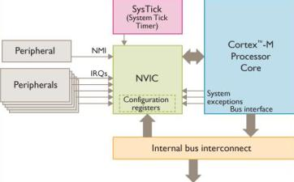

# STM32 Interrupts 

Interrupts are one of the major features of embedded systems, and most applications desire real-time response to interrupts. 

We work with the STM32L47x class of microcontrollers, which offers Ultra-Low Power. This means we want to "run fast, then stop". 

**ARM Cortex-M series processors feature a NVIC (Nested Vectored Interrupt Controller) for interrupt handling.** 

### Note: Interrupts are stored in FLASH, not in the NVIC 

The Cortex-M0/M0+ and M1 devices support only 32 interrupt requests (IRQs). 

Our **Cortex-M4 (or M3) support up to 240 IRQs, 1 NMI (non maskable interrupt), and system exceptions**. 

Most NVIC settings are programmable. The configurations registers are part of the memory map and can be accessed as C pointers. 

The Cortex Microcontroller Software Interface Standard (CMSIS) library also provides helper functions for interrupt handling. 

 

From the above diagram: 

 - NVIC is its own block in Silicon, and part of ARM IP. 
 - Manufacturer/User Peripherals can send interrupt signal 
 - ARM peripherals send interrupt signals (SysTick timer) 
 - ARM Core can send interrupt signals (system exceptions, i.e. 'somethin's wrong here') 
 - All interrupts go through NVIC (none directly connected to the ARM core) 
 - We can configure the NVIC for priority of each interrupt, and masking/unmasking 

### NVIC Functionality: 

 1. NVIC takes in all interrupt signals, and decides which one to forward to ARM core (based on priority) 
    - note that System Exceptions will typically have higher priority than peripheral IRQs 
    - EX: Div by 0 and ADC conversion interrupt happen at the same time? Handle the Div by 0 first. 

 2. If 2 interrupts arrive at the same time, one will be chosen based on priority. The IRQ that has less priority will eventually be serviced. 

 3. If interrupts fire while the ARM core is servicing another interrupt, the following can happen: 
    - If Nested interrupts, and priority of a new interrupt is higher, the lower priority interrupt is interrupted, and returned to later. We call this IRQ-ception 

    - If we don't have nested interrupts or priority is lower, it updates a flag (in the NVIC) saying the IRQ has service requested, and when the higher priority interrupt returns, it will service the next one. 

### Note: NVICs can support 8 bits of priority but most manufacturers who license the IP configure it with 3-4 bits (8-16 levels of priority) 

## Getting into it

### Glossary: 

**IRQ**: interrupt request (signal) 

**ISR**: interrupt service routine 

**NVIC**: the interrupt controller inside Cortex-M core that decides which interrupt to take based on priority and state (masked/unmasked) 

**NMI**: non-maskable interrupt (can't stop it from happening) 

**Vector Table**: lookup table of function addresses so the CPU knows what handler to jump to. 

For STM32L476RG, the core is Cortex-M4, so the interrupt mechanism is Cortex-M + STM32 Peripheral Interrupts 


## What Happens? 

 1. Peripheral/Source asserts interrupt request signal 

 2. Interrupt line becomes pending 

 3. NVIC checks if interrupt is enabled, it's priority, and if the CPU is running a higher priority interrupt/process 

 4. If accepted, CPU saves part of context on stack, reads the ISR from the Vector Table, and jumps to that ISR. 

 5. ISR runs 

 6. ISR clears the interrupt flag (if needed) and returns 

 7. CPU restores context and resumes 

## Where is it? 

In a CubeMX project, the vector table is defined in the assesmbly startup file: **startup_stm32l476xx.s** 

```
.section .isr_vector,"a",%progbits
.type g_pfnVectors, %object

g_pfnVectors:
  .word _estack
  .word Reset_Handler
  .word NMI_Handler
  .word HardFault_Handler
  .word MemManage_Handler
  .word BusFault_Handler
  .word UsageFault_Handler
  ...
  .word SysTick_Handler

  /* External Interrupts */
  .word WWDG_IRQHandler
  .word PVD_PVM_IRQHandler
  .word TAMP_STAMP_IRQHandler
  ...
  .word TIM2_IRQHandler
  .word USART1_IRQHandler
  ...
```

The table is an array of addresses: 
 - first entry = initial SP
 - second entry = reset handler 
 - everything else = exception/interrupt handler addresses 

**Note**: vector table is not in main.c, it is in the startup assembly file 

## Where are handlers defined? 

typically in: stm32l4xx_it.c and stm32l4xx_it.h 

The default handlers look like this usually: 

``` 
void TIM2_IRQHandler(void)
{
    HAL_TIM_IRQHandler(&htim2);
}
``` 

This means: 
 - vector table has TIM2_IRQHandler 
 - the actual function is in stm32l4xx_it.c 
 - handler calls into HAL usually (HAL handler) 

 Example: UART RX 

```
void USART2_IRQHandler(void)
{
    HAL_UART_IRQHandler(&huart2);
}
``` 

```
void HAL_UART_RxCpltCallback(UART_HandleTypeDef *huart)
{
    // your code here
}
``` 

## How does CPU know where the Vector Table is? 

Cortex-M4 uses VTOR 

VTOR = Vector Table Offset Register 

On reset, the table is placed at the beginning of flash, and VTOR points there (usually 0x08000000 on STM32) 

You can move it though! (If you want) 

```
SCB->VTOR = 0x08000000;
```

## CubeMX/HAL vs Bare Metal?

Again, to do it with HAL, just put your code in the Callback function: 

```
void TIM2_IRQHandler(void)
{
    HAL_TIM_IRQHandler(&htim2);
}
``` 

```
void HAL_TIM_PeriodElapsedCallback(TIM_HandleTypeDef *htim)
{
    if (htim->Instance == TIM2) {
        // your code
    }
}
``` 

**Note**: this is the CubeMX/HAL way 


If 
 - function name matches symbol in vector table 
 - interrupt is enabled in the peripheral
 - interrupt is enabled in the NVIC 

```
void TIM2_IRQHandler(void)
{
    if (TIM2->SR & TIM_SR_UIF) {
        TIM2->SR &= ~TIM_SR_UIF;   // clear update interrupt flag
        // do stuff
    }
}
```

**Note**: handler is note "loaded" into the vector tabe. It is NOT dynamically loaded at runtime, it is linked in at build time. 

The startup file entry would be 

```
.word TIM2_IRQHandler
```

Make sure to configure the peripheral to generate interrupts: 

```
TIM2->DIER |= TIM_DIER_UIE;   // enable update interrupt in timer
``` 

Then enable the IRQ in the NVIC: 
```
NVIC_EnableIRQ(TIM2_IRQn);
```

and optionally, set the priority: 
```
NVIC_SetPriority(TIM2_IRQn, 5);
```

**Note**: TIM2_IRQn is the interrupt number identifier. 

```
typedef enum
{
  ...
  TIM2_IRQn = 28,
  ...
} IRQn_Type;
``` 

## So where does CubeMX put everything 

 - Startup/Vector Table: **startup_stm32l476xx.s** 
 - Exception and interrupt handler functions: 
 **Core/Src/stm32l4xx_it.c**
 **Core/Src/stm32l4xx_it.h** 
 - HAL callbacks and main application logic: 
 **Core/Src/main.c** 
 - NVIC Configuration: 
 **main.c** 

## What does CPU save on interrupt entry: 
stacks: 
 - R0
 - R1
 - R2
 - R3
 - R12
 - LR
 - PC
 - xPSR  
then branches to the ISR 

## Exceptions vs Interrupts? 
Exceptions: 
 - Reset
 - NMI
 - HardFault
 - MemManage
 - BusFault
 - UsageFault
 - SVCall
 - PendSV
 - SysTick 
External Interrupts: 
 - TIM2
 - USART2
 - EXTI15_10
 - ADC1_2
 - DMA channels 

## No CubeMX? 

1. Write startup file with Vector Table 
2. Write SystemInit() and clock setup
3. Define ISR with exact correct name 
4. Configure peripheral's interrupt enable bit 
5. Set NVIC priority 
6. Enable NVIC IRQ 
7. Clear Peripheral Flags in ISR 

```
#include "stm32l476xx.h"

void TIM2_IRQHandler(void)
{
    if (TIM2->SR & TIM_SR_UIF) {
        TIM2->SR &= ~TIM_SR_UIF;
        GPIOA->ODR ^= (1U << 5);
    }
}

int main(void)
{
    RCC->AHB2ENR |= RCC_AHB2ENR_GPIOAEN;
    GPIOA->MODER &= ~(3U << (5 * 2));
    GPIOA->MODER |=  (1U << (5 * 2));

    RCC->APB1ENR1 |= RCC_APB1ENR1_TIM2EN;
    TIM2->PSC = 7999;
    TIM2->ARR = 999;
    TIM2->DIER |= TIM_DIER_UIE;
    TIM2->CR1 |= TIM_CR1_CEN;

    NVIC_SetPriority(TIM2_IRQn, 5);
    NVIC_EnableIRQ(TIM2_IRQn);

    while (1) {
    }
}
```

